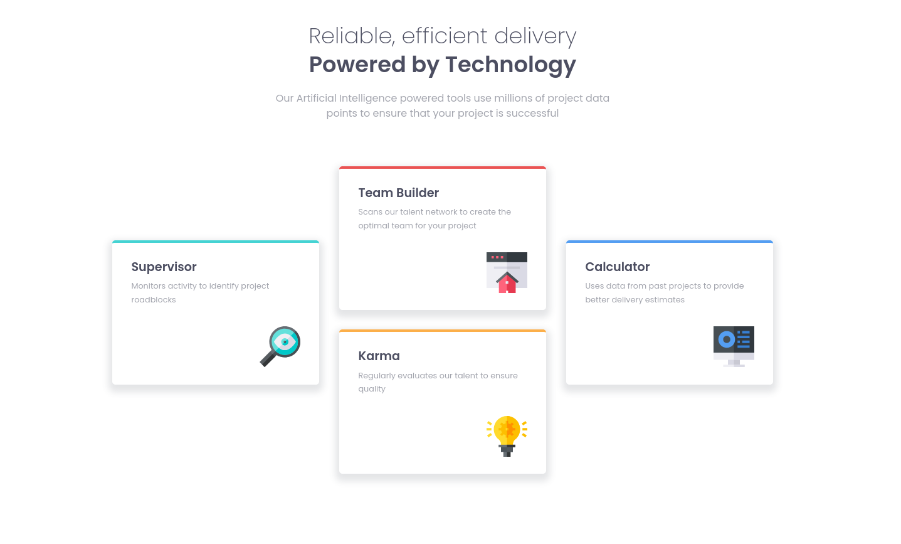

# Frontend Mentor - Four card feature section solution

This is a solution to the [Four card feature section challenge on Frontend Mentor](https://www.frontendmentor.io/challenges/four-card-feature-section-weK1eFYK). Frontend Mentor challenges help you improve your coding skills by building realistic projects. 

## Table of contents

- [Overview](#overview)
  - [The challenge](#the-challenge)
  - [Screenshot](#screenshot)
- [My process](#my-process)
  - [Built with](#built-with)
  - [What I learned](#what-i-learned)
  - [Continued development](#continued-development)
  - [Useful resources](#useful-resources)
- [Author](#author)


## Overview

### The challenge

Users should be able to:

- View the optimal layout for the site depending on their device's screen size

### Screenshot



### Built with

- Semantic HTML5 markup
- SASS
- Flexbox
- CSS
- Mobile-first workflow
- BEM Methodology

### What I learned

Using float can cause some layout issues, the easy way to fix this is by applying the followig properties to the parent container

```css
.main-card:after {
  content: '.';
  visibility: hidden;
  display: block;
  height: 0;
  clear: both;
}
```

### Continued development

I want to keep focusing on BEM methodology and it's perfect usage with SASS. I also want to improve my responsive web design skills using flexbox and grid system.

### Useful resources

- [All about floats](https://css-tricks.com/all-about-floats/) - This section helped me to solve some issues when using float 
commend it to anyone still learning this concept.

## Author

- Frontend Mentor - [@tamerlantian](https://www.frontendmentor.io/profile/tamerlantian)
- Twitter - [@2301_ian](https://twitter.com/2301_ian)

